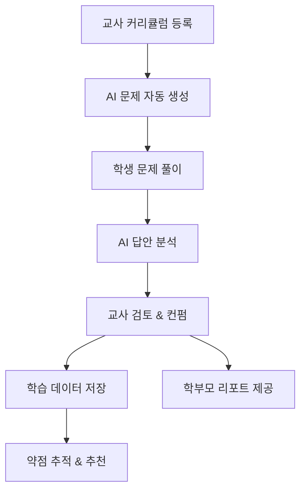

# Learning Elevate – 서비스 기획서 (v0.1)

## 📋 문서 정보

- **작성일**: 2025-11-17
- **버전**: 0.1.0
- **상태**: 초안
- **작성자**: Product Team

---

## 1. 서비스 개요

### 1-1. 서비스 정의

Learning Elevate는 **선생님/강사를 위한 AI 기반 학습 향상 플랫폼**으로,

교사가 정의한 커리큘럼을 바탕으로 학생 수준에 맞는 문제를 자동 생성하고,

학생 답안을 AI가 분석하여 취약 영역을 설명·보완하며,

교사는 이를 검토·컨펌만 하는 구조의 서비스입니다.

**1차 타깃 과목은 영어**이며, 이후 수학, 국어, 과학 등으로 확장 가능한 구조를 기본 전제로 설계합니다.

### 1-2. 핵심 목표

- ✅ 교사의 반복적인 문제 제작, 채점, 피드백 업무를 AI로 대체/축소
- ✅ 학생 개개인의 취약점을 정밀하게 파악하여 맞춤형 피드백 제공
- ✅ 학부모에게 신뢰도 높은 학습 리포트를 제공하여 서비스 가치를 증명
- ✅ 중장기적으로는 "선생님 없이도 작동 가능한 AI 튜터"로의 진화

### 1-3. 주요 사용자 유형

| 사용자 유형 | 설명 | 주요 니즈 |
|------------|------|----------|
| **교사/강사 (Teacher)** | 커리큘럼 관리 및 학생 학습 감독 | 업무 자동화, 학생 현황 파악 |
| **학생 (Student)** | 문제 풀이 및 학습 수행 | 맞춤형 학습, 즉각적 피드백 |
| **학부모 (Parent)** | 자녀 학습 현황 모니터링 | 투명한 학습 리포트, 진도 확인 |
| **운영자 (Admin)** | 시스템 관리 및 데이터 분석 | 서비스 운영, 사용자 관리 |

---

## 2. 사용자별 핵심 가치

### 2-1. 교사/강사 👨‍🏫

**핵심 가치**
- 보유 커리큘럼을 그대로 시스템에 올려, 문제·숙제를 자동 생성
- 채점/피드백 시간을 최소화하고, 최종 검토·컨펌에만 집중
- 학급/학생별 학습 현황을 한눈에 확인

**Pain Points 해결**
- ❌ 매번 새로운 문제 만들기 → ✅ AI 자동 생성
- ❌ 수작업 채점 및 피드백 작성 → ✅ AI 자동 분석 + 교사 검토
- ❌ 학생별 약점 파악 어려움 → ✅ 데이터 기반 약점 분석

### 2-2. 학생 👦👧

**핵심 가치**
- 자신의 레벨에 맞는 문제를 받아 단계적으로 학습
- 오답에 대해 AI로부터 자세한 설명과 추가 예시를 제공받음
- 반복 학습을 통해 약점을 점진적으로 해소

**학습 경험 개선**
- ✅ 개인화된 학습 경로
- ✅ 즉각적인 피드백
- ✅ 게임화된 학습 경험 (향후 고려)

### 2-3. 학부모 👨‍👩‍👧‍👦

**핵심 가치**
- 자녀의 현재 수준, 강점·취약 영역, 최근 학습 내용/진행도 확인
- 교사/AI가 제공한 피드백을 투명하게 열람

**신뢰 구축**
- ✅ 데이터 기반 학습 리포트
- ✅ 교사의 전문적 검토 포함
- ✅ 학습 진행 상황 실시간 확인

---

## 3. 핵심 기능 개요

### 핵심 기능 목록

1. **교사 커리큘럼 등록** - 수업 계획을 시스템에 입력
2. **단계별 문제 자동 생성** - AI가 커리큘럼 기반 문제 생성
3. **학생 레벨 기반 문제 풀이** - 개인화된 학습 경험 제공
4. **AI 답안 분석 및 취약 영역 설명** - 자동 채점 및 상세 피드백
5. **교사 검토 및 최종 컨펌** - 교사의 전문성 보장
6. **학습 데이터 저장 및 약점 추적** - 지속적인 학습 개선
7. **학부모용 학습 리포트** - 투명한 학습 현황 공유

---

## 4. MVP 범위 정의

### 4-1. MVP 포함 범위 ✅

**과목**
- 영어만 지원

**사용자**
- 교사 / 학생 / 학부모 계정 기본 구조

**핵심 기능**
- ✅ 교사 커리큘럼 등록 (웹 폼 기반 기본 버전)
- ✅ 단원별 문제 자동 생성 (객관식 + 간단 단답형 중심)
- ✅ 학생 문제 풀이 및 자동 채점
- ✅ AI 기본 피드백 (정오 설명 + 정답 예시)
- ✅ 교사 검토/컨펌 기능 (단순 편집 + 컨펌)
- ✅ 학생별 학습 기록 저장 및 간단 약점 태그 표시
- ✅ 학부모용 요약 리포트 화면 (기본 버전)

### 4-2. MVP 제외 범위 (향후 버전) 🔮

- ❌ 수학/국어/과학 등 다른 과목
- ❌ 음성/리스닝 문제 지원
- ❌ 시험 모드/숙제 모드 분리
- ❌ 학교/학원 단위 관리자 기능
- ❌ 완전 자동화 모드 (교사 개입 없음)
- ❌ 엑셀/문서 업로드 기반 커리큘럼 등록
- ❌ 게임화 요소 (포인트, 배지 등)

---

## 5. 비즈니스 모델 (초안)

### 5-1. 수익 모델

| 모델 | 설명 | 타깃 |
|------|------|------|
| **프리미엄 구독** | 월/연 단위 구독 (교사당) | 개인 교사, 소규모 학원 |
| **기관 라이선스** | 학교/학원 단위 패키지 | 교육 기관 |
| **학생 수 기반** | 관리하는 학생 수에 따른 과금 | 대형 학원 |

### 5-2. 경쟁 우위

- ✅ **교사 중심 설계**: 교사의 워크플로우를 존중하며 자동화
- ✅ **한국 교육 시장 특화**: 한국 교육 환경에 최적화
- ✅ **AI + 교사 협업 모델**: 완전 자동화가 아닌 교사 검토 포함
- ✅ **확장 가능한 구조**: 다양한 과목으로 확장 가능

---

## 6. 향후 확장 방향

### Phase 1 (MVP) - 2025 Q1
- 영어 과목 기본 기능 구현
- 교사/학생/학부모 기본 기능

### Phase 2 - 2025 Q2
- 수학 과목 추가
- 시험 모드 / 숙제 모드 분리
- 학습 분석 고도화

### Phase 3 - 2025 Q3-Q4
- 국어, 과학 과목 추가
- 음성/리스닝 기능
- 학교/학원 관리자 기능
- 게임화 요소 추가

### Phase 4 - 2026+
- AI 튜터 완전 자동화 모드
- 글로벌 시장 진출 (영어권)
- B2B SaaS 플랫폼 전환

---

## 7. 성공 지표 (KPI)

### 사용자 지표
- 월간 활성 교사 수 (MAU - Teachers)
- 월간 활성 학생 수 (MAU - Students)
- 학부모 리포트 조회율

### 서비스 지표
- 문제 자동 생성 정확도
- AI 피드백 만족도
- 교사 검토 소요 시간 감소율

### 비즈니스 지표
- 유료 전환율
- 고객 생애 가치 (LTV)
- 이탈률 (Churn Rate)

---

## 8. 관련 문서

- [기능 명세서](./feature-specification.md)
- [사용자 시나리오](./user-scenarios.md)
- [화면 설계서](../design/screen-design.md)
- [데이터베이스 스키마](../development/database-schema.md)

---

## 변경 이력

| 날짜 | 버전 | 변경 내용 | 작성자 |
|------|------|----------|--------|
| 2025-11-17 | 0.1.0 | 초안 작성 | Product Team |

---

**문서 상태**: 🟡 초안 (Draft)  
**다음 리뷰 예정**: 2025-11-24

